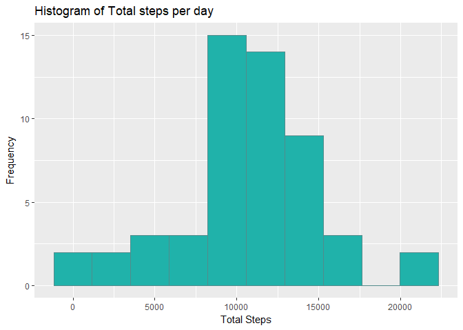
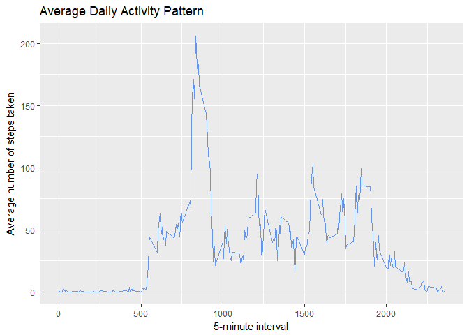
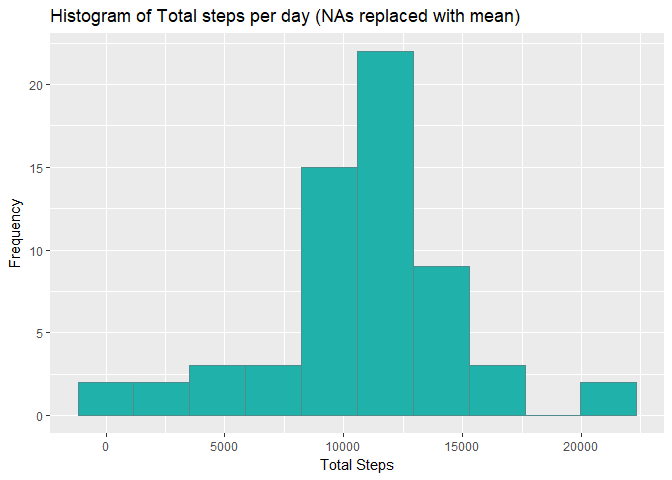
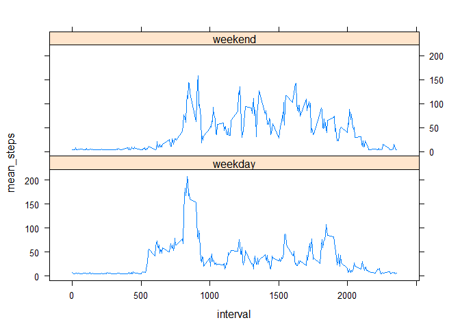

##Assignment
This assignment will be described in multiple parts. You will need to write a report that answers the questions detailed below. Ultimately, you will need to complete the entire assignment in a single R markdown document that can be processed by knitr and be transformed into an HTML file.

The submission must include the following

1. Code for reading in the dataset and/or processing the data
2. Histogram of the total number of steps taken each day
3. Mean and median number of steps taken each day
4. Time series plot of the average number of steps taken
5. The 5-minute interval that, on average, contains the maximum number of steps
6. Code to describe and show a strategy for imputing missing data
7. Histogram of the total number of steps taken each day after missing values are imputed
8. Panel plot comparing the average number of steps taken per 5-minute interval across weekdays and weekends
9. All of the R code needed to reproduce the results (numbers, plots, etc.) in the report

###Read the data

```r
if (!file.exists('activity.csv')) {
  unzip(zipfile = "repdataFdataFactivity.zip")
}

activity_info <- read.csv("activity.csv", header = T)
```

###Total number of steps per day

```r
# Calculate the total steps taken per day
total_Steps <- aggregate(steps ~ date, activity_info, FUN=sum, na.rm=T)
head(total_Steps)
```

```
##         date steps
## 1 2012-10-02   126
## 2 2012-10-03 11352
## 3 2012-10-04 12116
## 4 2012-10-05 13294
## 5 2012-10-06 15420
## 6 2012-10-07 11015
```

```r
library(ggplot2)
```

```
## Warning: package 'ggplot2' was built under R version 3.4.2
```

```r
ggplot(total_Steps, aes(x=steps)) + geom_histogram(bins=10, fill="lightseagreen", colour= "darkslategray4") +
      xlab("Total Steps") + ylab("Frequency") + ggtitle("Histogram of Total steps per day")
```

<!-- -->

###Mean and median number of steps taken each day
For the mean and median we will use the summary command. The mean and median can be read from the summary, this is the mean and median excluding the NAs.

```r
with(total_Steps, { stats <- summary(steps)
stats })
```

```
##    Min. 1st Qu.  Median    Mean 3rd Qu.    Max. 
##      41    8841   10765   10766   13294   21194
```

```r
# You can also calculate the mean and median directly as follows
# mean_Steps <- mean(total_Steps$steps, na.rm=T)
# mean_Steps
# median_Steps <- median(total_Steps$steps, na.rm=T)
# median_Steps
```

###What is the average daily activity pattern?

```r
# Make a time series plot (i.e. type = "l") of the 5-minute interval (x-axis) and the average number of steps
# taken, averaged across all days (y-axis)
average_daily_activity <- aggregate(steps ~ interval, activity_info, FUN=mean, na.rm=T)
tail(average_daily_activity)
```

```
##     interval     steps
## 283     2330 2.6037736
## 284     2335 4.6981132
## 285     2340 3.3018868
## 286     2345 0.6415094
## 287     2350 0.2264151
## 288     2355 1.0754717
```

```r
ggplot(average_daily_activity, aes(x=interval, y=steps)) + geom_line(colour="cornflowerblue") + 
      ggtitle("Average Daily Activity Pattern") + xlab("5-minute interval") +
      ylab("Average number of steps taken")
```

<!-- -->

```r
#Which 5-minute interval, on average across all the days in the dataset, contains the maximum number of steps?
max_interval <- average_daily_activity[which.max(average_daily_activity$steps),]
max_interval$interval
```

```
## [1] 835
```

###Imputing missing values

```r
#The total number of rows with NAs - if you look at the data only the steps field has NAs
colSums(is.na(activity_info))
```

```
##    steps     date interval 
##     2304        0        0
```

```r
num_NAs <- sum(is.na(activity_info))
num_NAs
```

```
## [1] 2304
```

```r
no_NAs_activity <- activity_info
new_val <- mean(activity_info$steps, na.rm = T)
# na_place <- which(is.na(activity_info))
# length(na_place)
# vec_of_means <- rep(new_val, times=length(na_place))
# no_NAs_activity[na_place, "steps"] <- vec_of_means


no_NAs_activity$steps[is.na(no_NAs_activity$steps)] <- new_val
no_NAs_activity_tot <- aggregate(steps ~ date, no_NAs_activity, FUN=sum, na.rm=T)
ggplot(no_NAs_activity_tot, aes(x=steps)) + geom_histogram(bins=10, fill="lightseagreen", 
      colour= "darkslategray4") +
      xlab("Total Steps") + ylab("Frequency") + 
      ggtitle("Histogram of Total steps per day (NAs replaced with mean)")
```

<!-- -->

```r
#The mean and median are still similar to before
with(no_NAs_activity_tot, { stats <- summary(steps)
stats })
```

```
##    Min. 1st Qu.  Median    Mean 3rd Qu.    Max. 
##      41    9819   10766   10766   12811   21194
```

###Are there differences in activity patterns between weekdays and weekends?

```r
library(dplyr)
```

```
## Warning: package 'dplyr' was built under R version 3.4.2
```

```
## 
## Attaching package: 'dplyr'
```

```
## The following objects are masked from 'package:stats':
## 
##     filter, lag
```

```
## The following objects are masked from 'package:base':
## 
##     intersect, setdiff, setequal, union
```

```r
no_NAs_activity$day <- weekdays(as.Date(no_NAs_activity$date))
#head(no_NAs_activity)
no_NAs_activity$dayType <- with(no_NAs_activity, day=="Saturday" | day=="Sunday")
head(no_NAs_activity)
```

```
##     steps       date interval    day dayType
## 1 37.3826 2012-10-01        0 Monday   FALSE
## 2 37.3826 2012-10-01        5 Monday   FALSE
## 3 37.3826 2012-10-01       10 Monday   FALSE
## 4 37.3826 2012-10-01       15 Monday   FALSE
## 5 37.3826 2012-10-01       20 Monday   FALSE
## 6 37.3826 2012-10-01       25 Monday   FALSE
```

```r
no_NAs_activity <- mutate(no_NAs_activity,dayType = ifelse(dayType==T, "weekend", "weekday"))
head(no_NAs_activity)
```

```
##     steps       date interval    day dayType
## 1 37.3826 2012-10-01        0 Monday weekday
## 2 37.3826 2012-10-01        5 Monday weekday
## 3 37.3826 2012-10-01       10 Monday weekday
## 4 37.3826 2012-10-01       15 Monday weekday
## 5 37.3826 2012-10-01       20 Monday weekday
## 6 37.3826 2012-10-01       25 Monday weekday
```

```r
no_NAs_activity_mean <- aggregate(no_NAs_activity$steps, 
                      list(interval = as.numeric(as.character(no_NAs_activity$interval)), 
                           dayType = no_NAs_activity$dayType),
                      FUN = "mean")
head(no_NAs_activity_mean)
```

```
##   interval dayType        x
## 1        0 weekday 7.006569
## 2        5 weekday 5.384347
## 3       10 weekday 5.139902
## 4       15 weekday 5.162124
## 5       20 weekday 5.073235
## 6       25 weekday 6.295458
```

```r
names(no_NAs_activity_mean)[3] <- "mean_steps"
library(lattice)
xyplot(mean_steps ~ interval | dayType, data = no_NAs_activity_mean, type = "l", layout = c(1,2))
```

<!-- -->
